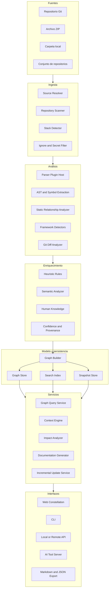
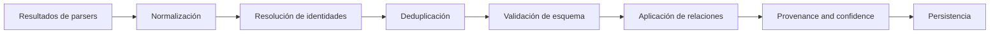
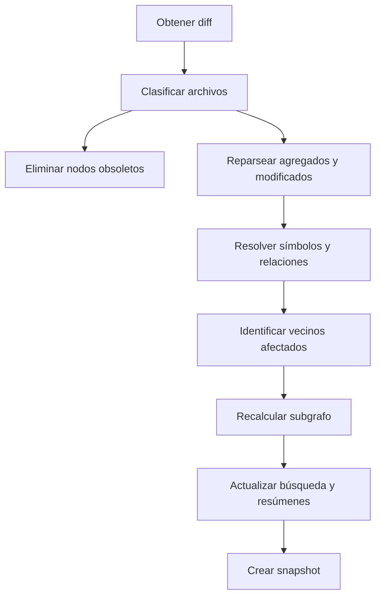
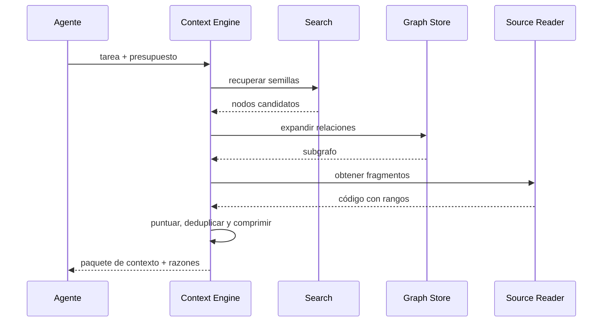

# Codestellation — Arquitectura técnica y componentes

## 1. Objetivo de la arquitectura

La arquitectura debe permitir que Codestellation:

- analice repositorios heterogéneos;
- produzca un grafo común;
- funcione localmente;
- exponga capacidades a humanos y agentes de IA;
- actualice el conocimiento de manera incremental;
- escale desde un solo repositorio hasta ecosistemas multirepo;
- sustituya tecnologías internas sin cambiar el contrato conceptual.

El diseño debe separar cinco responsabilidades:

1. adquisición del código;
2. análisis determinístico;
3. enriquecimiento semántico;
4. almacenamiento y consulta;
5. presentación y exportación de contexto.

---

## 2. Vista de arquitectura



---

## 3. Estructura recomendada del repositorio

Para el MVP, se recomienda un monorepo:

```text
codestellation/
├── apps/
│   ├── web/                    # interfaz de constelación
│   ├── api/                    # API local/remota
│   └── cli/                    # comandos de terminal
├── packages/
│   ├── contracts/              # tipos y contratos compartidos
│   ├── graph-model/            # modelo canónico de nodos y relaciones
│   ├── source-ingestion/       # ZIP, Git y carpeta
│   ├── repository-scanner/     # inventario y metadatos
│   ├── parser-core/            # host e interfaces para parsers
│   ├── parser-typescript/      # primer parser
│   ├── analyzer-static/        # imports, calls, exports, etc.
│   ├── analyzer-frameworks/    # React, Next, Express
│   ├── analyzer-semantic/      # inferencia opcional
│   ├── graph-builder/          # normalización y ensamblaje
│   ├── graph-store/            # adaptadores de persistencia
│   ├── search-index/           # búsqueda textual, simbólica y semántica
│   ├── context-engine/         # selección para tareas de IA
│   ├── impact-engine/          # radio de impacto
│   ├── snapshot-engine/        # snapshots y diffs
│   ├── exporter/               # Markdown, JSON, Mermaid
│   ├── agent-adapter/          # herramientas para agentes
│   ├── config/                 # configuración común
│   ├── observability/          # logs, métricas y trazas
│   └── testing-fixtures/       # repositorios de prueba
├── docs/
├── examples/
├── scripts/
├── tests/
├── CODESTELLATION_PROJECT_STATE.md
├── CODESTELLATION_DECISIONS.md
└── README.md
```

### Regla de dependencias internas

Los paquetes deben seguir una dirección clara:

```text
contracts
   ↑
graph-model
   ↑
parser/analyzers
   ↑
graph-builder/store/search
   ↑
context/impact/snapshot/exporter
   ↑
api/cli/web/agent-adapter
```

Una capa inferior no debe importar una capa superior.

---

## 4. Componentes principales

## 4.1 Source Resolver

### Responsabilidad

Convertir una entrada del usuario en una fuente local estable y segura.

### Entradas

- ruta local;
- ZIP;
- URL Git;
- commit, rama o tag;
- credencial indirecta;
- opciones de profundidad y submódulos.

### Salidas

```ts
interface ResolvedSource {
  sourceId: string;
  rootPath: string;
  sourceType: "folder" | "zip" | "git";
  repositoryUrl?: string;
  revision?: string;
  branch?: string;
  isTemporary: boolean;
}
```

### Reglas

- nunca registrar tokens;
- validar rutas contra traversal;
- limitar tamaño de ZIP;
- detectar symlinks peligrosos;
- permitir limpieza automática;
- no ejecutar hooks del repositorio.

---

## 4.2 Repository Scanner

### Responsabilidad

Crear un inventario inicial sin interpretar todavía el contenido completo.

### Detecta

- archivos y directorios;
- tamaño;
- hash;
- extensión;
- lenguaje probable;
- archivos generados;
- vendored code;
- binarios;
- documentación;
- tests;
- manifiestos;
- archivos de configuración;
- archivos ignorados.

### Salida conceptual

```ts
interface RepositoryInventory {
  repository: RepositoryDescriptor;
  files: FileDescriptor[];
  manifests: ManifestDescriptor[];
  detectedStacks: StackDetection[];
  warnings: ScanWarning[];
}
```

### Exclusiones por defecto

- `.git`;
- directorios de dependencias;
- builds;
- cachés;
- cobertura;
- binarios;
- archivos minificados;
- archivos generados detectables;
- secretos conocidos.

Toda exclusión debe ser configurable y visible.

---

## 4.3 Stack Detector

### Responsabilidad

Determinar cómo analizar el proyecto.

### Fuentes de evidencia

- nombres de archivos;
- manifiestos;
- dependencias;
- configuraciones;
- estructura de directorios;
- imports;
- convenciones de framework.

### Ejemplo

```json
{
  "languages": [
    {"name": "typescript", "confidence": 1.0}
  ],
  "frameworks": [
    {"name": "react", "confidence": 0.98, "evidence": ["package.json"]},
    {"name": "nextjs", "confidence": 0.91, "evidence": ["next.config.js", "app/"]}
  ],
  "packageManagers": ["pnpm"],
  "workspaceType": "monorepo"
}
```

---

## 4.4 Parser Plugin Host

### Objetivo

Permitir incorporar lenguajes sin cambiar el resto de la plataforma.

### Contrato mínimo

```ts
interface LanguageParserPlugin {
  id: string;
  supportedLanguages: string[];
  canParse(file: SourceFile): boolean;
  parse(file: SourceFile, context: ParseContext): Promise<ParseResult>;
  getVersion(): string;
}
```

### ParseResult

Debe producir datos normalizados, no objetos específicos del parser:

```ts
interface ParseResult {
  fileNode: GraphNodeInput;
  symbols: SymbolRecord[];
  references: ReferenceRecord[];
  imports: ImportRecord[];
  exports: ExportRecord[];
  diagnostics: ParserDiagnostic[];
  provenance: ProvenanceRecord;
}
```

### Requisitos

- resultados determinísticos;
- offsets y líneas exactas;
- tolerancia a archivos con errores;
- timeout por archivo;
- límites de memoria;
- versión del parser registrada;
- pruebas contractuales compartidas.

---

## 4.5 TypeScript/JavaScript Parser

Primer plugin oficial.

### Debe extraer

- módulos;
- imports dinámicos y estáticos;
- exports;
- variables relevantes;
- funciones;
- clases;
- métodos;
- interfaces y tipos;
- llamadas identificables;
- JSX y componentes;
- hooks;
- decoradores cuando existan;
- rutas de origen;
- comentarios de documentación;
- rangos de código.

### Identidad de símbolos

Cada símbolo debe tener una clave estable tanto como sea posible:

```text
<repository-id>:<relative-path>:<symbol-kind>:<qualified-name>
```

Para resistir movimientos o renombres, se puede complementar con:

- hash estructural;
- firma;
- símbolo padre;
- rango aproximado;
- historial Git.

---

## 4.6 Static Relationship Analyzer

### Responsabilidad

Convertir referencias y estructuras en relaciones del grafo.

### Relaciones

- archivo contiene símbolo;
- archivo importa módulo;
- símbolo exporta;
- función llama función;
- clase extiende clase;
- clase implementa interfaz;
- componente renderiza componente;
- test cubre símbolo;
- configuración habilita módulo;
- paquete depende de paquete.

### Resolución

Debe manejar:

- rutas relativas;
- aliases;
- workspaces;
- exports de paquetes;
- index files;
- extensiones implícitas;
- resolución específica de framework;
- dependencias externas.

Cuando no pueda resolver, debe crear una relación no resuelta, no inventar un destino.

---

## 4.7 Framework Analyzers

Plugins especializados que toman resultados del parser y agregan semántica confirmable.

### React

- componentes;
- props;
- renderiza;
- hooks;
- proveedores de contexto;
- rutas si se detecta router;
- páginas y layouts.

### Next.js

- app/pages router;
- páginas;
- layouts;
- route handlers;
- server/client components;
- middleware;
- configuración;
- rutas dinámicas.

### Express o HTTP similar

- routers;
- verbos;
- paths;
- handlers;
- middleware;
- controladores;
- cadena de montaje.

### Principio

El analizador de framework debe producir relaciones con evidencia y no ocultar su origen.

---

## 4.8 Semantic Analyzer

### Responsabilidad

Agregar información que no se obtiene directamente del AST.

### Capacidades

- resumen de archivo o módulo;
- responsabilidad probable;
- conceptos de negocio;
- agrupación funcional;
- título humano;
- flujos sugeridos;
- riesgos o anomalías;
- relaciones semánticas.

### Modos

1. desactivado;
2. reglas locales;
3. modelo local;
4. proveedor remoto autorizado.

### Restricciones

- la salida siempre se marca como inferida;
- debe registrar modelo, prompt hash y fecha;
- no puede sobrescribir evidencia confirmada;
- debe poder regenerarse;
- debe respetar presupuesto y privacidad.

---

## 4.9 Graph Builder

### Responsabilidad

Normalizar, deduplicar, validar y ensamblar el grafo.

### Pipeline



### Reglas

- IDs estables;
- nodos sin relaciones siguen siendo válidos;
- una relación requiere tipo y origen;
- todos los rangos deben referirse a una revisión;
- las eliminaciones deben quedar reflejadas;
- no se debe guardar un grafo inválido parcialmente sin estado explícito.

---

## 4.10 Graph Store

Debe exponerse mediante una interfaz abstracta.

```ts
interface GraphStore {
  upsertNodes(nodes: GraphNode[]): Promise<void>;
  upsertEdges(edges: GraphEdge[]): Promise<void>;
  deleteNodes(ids: string[]): Promise<void>;
  deleteEdges(ids: string[]): Promise<void>;
  getNode(id: string): Promise<GraphNode | null>;
  getNeighbors(query: NeighborQuery): Promise<GraphNeighborhood>;
  findPath(query: PathQuery): Promise<GraphPath[]>;
  query(query: GraphQuery): Promise<GraphQueryResult>;
  transaction<T>(work: () => Promise<T>): Promise<T>;
}
```

### Opciones de implementación

Para el MVP:

- almacenamiento relacional con tablas de nodos y relaciones;
- o motor de grafo embebido/local.

Para escalamiento:

- base de grafos dedicada;
- índices especializados;
- almacenamiento separado de snapshots.

La primera decisión debe priorizar:

- instalación local fácil;
- backups sencillos;
- migraciones;
- consultas suficientes;
- reemplazo posterior.

---

## 4.11 Search Index

La búsqueda debe combinar:

1. coincidencia exacta de símbolos;
2. texto;
3. metadatos;
4. relaciones;
5. semántica opcional;
6. historial de uso.

### Resultado

```ts
interface SearchHit {
  nodeId: string;
  score: number;
  reasons: SearchReason[];
  matchedFields: string[];
  snippet?: string;
}
```

El resultado debe explicar por qué un nodo fue recuperado.

---

## 4.12 Context Engine

El motor de contexto recibe una tarea y construye un subgrafo útil.

### Entradas

- texto de la tarea;
- nodos seleccionados;
- archivos abiertos;
- presupuesto de tokens;
- profundidad;
- riesgo;
- proveedor o formato de destino;
- reglas de inclusión/exclusión.

### Proceso

1. clasificar la intención;
2. recuperar semillas;
3. expandir relaciones relevantes;
4. incluir contratos y consumidores;
5. agregar pruebas y configuración;
6. puntuar relevancia;
7. deduplicar;
8. comprimir por niveles;
9. verificar presupuesto;
10. producir explicación de selección.

### Salida

- resumen del proyecto;
- objetivo de tarea;
- nodos relevantes;
- archivos completos o fragmentos;
- dependencias;
- reglas;
- decisiones;
- pruebas;
- riesgos;
- información faltante;
- orden recomendado de lectura.

---

## 4.13 Impact Engine

### Objetivo

Estimar qué puede verse afectado por un cambio.

### Tipos de impacto

- estructural;
- ejecución probable;
- contrato público;
- datos;
- configuración;
- pruebas;
- infraestructura;
- documentación;
- cross-repository.

### Salida

```ts
interface ImpactReport {
  targetNodes: string[];
  directConsumers: ImpactItem[];
  indirectConsumers: ImpactItem[];
  affectedFlows: ImpactItem[];
  affectedTests: ImpactItem[];
  possibleMigrations: ImpactItem[];
  confidence: number;
  limitations: string[];
}
```

La palabra “posible” debe usarse cuando no haya evidencia determinística.

---

## 4.14 Snapshot and Incremental Update Engine

### Snapshot

Un snapshot registra:

- revisión Git;
- fecha;
- configuración del análisis;
- versiones de parsers;
- hashes de archivos;
- esquema del grafo;
- estado de indexación;
- warnings.

### Actualización incremental



### Casos especiales

- renombres;
- movimientos;
- cambio de alias;
- cambio de configuración global;
- cambio de versión del parser;
- cambio de esquema;
- merge commits;
- archivos generados.

Un cambio global puede invalidar más archivos que el diff directo.

---

## 4.15 Web Constellation

### Responsabilidades

- renderizar el grafo por capas;
- solicitar datos de forma progresiva;
- mantener selección y filtros;
- mostrar panel de detalles;
- abrir código;
- construir vistas por tarea;
- mostrar impacto;
- comparar snapshots.

### Estado mínimo de UI

```ts
interface ConstellationViewState {
  projectId: string;
  snapshotId: string;
  perspective: string;
  expandedNodeIds: string[];
  selectedNodeIds: string[];
  hiddenNodeTypes: string[];
  hiddenEdgeTypes: string[];
  depth: number;
  searchQuery?: string;
  layout?: string;
}
```

### Regla de rendimiento

El cliente nunca debe recibir el grafo completo de un proyecto grande por defecto.

---

## 4.16 API

### Dominios sugeridos

- projects;
- sources;
- indexing;
- nodes;
- edges;
- search;
- flows;
- impact;
- context;
- snapshots;
- notes;
- settings.

### Ejemplos conceptuales

```text
POST   /projects
POST   /projects/:id/index
GET    /projects/:id/status
GET    /projects/:id/overview
GET    /projects/:id/nodes/:nodeId
GET    /projects/:id/neighborhood
GET    /projects/:id/search
POST   /projects/:id/context
POST   /projects/:id/impact
POST   /projects/:id/update
GET    /projects/:id/snapshots
GET    /projects/:id/diff
```

### Reglas

- versionar API;
- paginar;
- limitar profundidad;
- cancelar trabajos;
- idempotencia para indexación;
- errores estructurados;
- correlation IDs;
- no devolver código sin autorización.

---

## 4.17 CLI

### Comandos del MVP

```text
init
index
status
serve
search
node
neighbors
path
context
impact
update
export
config
```

### Filosofía

La CLI debe ser completamente utilizable sin la interfaz web. Esto facilita:

- integración con agentes;
- CI;
- automatización;
- ejecución local;
- pruebas end-to-end.

---

## 4.18 Agent Adapter

Debe exponer herramientas pequeñas y determinísticas.

### Herramientas recomendadas

```text
codestellation_project_overview
codestellation_search
codestellation_get_node
codestellation_get_code
codestellation_get_neighbors
codestellation_find_path
codestellation_get_flow
codestellation_build_context
codestellation_impact
codestellation_get_rules
codestellation_update_index
codestellation_get_snapshot_diff
```

### Regla

El adaptador no debe permitir que el agente ejecute comandos arbitrarios del sistema.

---

## 5. Procesamiento de una indexación

```mermaid
sequenceDiagram
    participant U as Usuario/Agente
    participant API as API/CLI
    participant SRC as Source Resolver
    participant SCN as Scanner
    participant PAR as Parser Host
    participant ANA as Analyzers
    participant GRF as Graph Builder
    participant DB as Stores

    U->>API: indexar fuente
    API->>SRC: resolver fuente
    SRC-->>API: ruta y revisión
    API->>SCN: escanear
    SCN-->>API: inventario y stack
    API->>PAR: parsear archivos elegibles
    PAR-->>ANA: símbolos y referencias
    ANA-->>GRF: nodos y relaciones
    GRF->>DB: transacción de snapshot
    DB-->>API: snapshot listo
    API-->>U: estado, warnings y resumen
```

---

## 6. Procesamiento de una tarea para IA



---

## 7. Contratos compartidos esenciales

### GraphNode

```ts
interface GraphNode {
  id: string;
  projectId: string;
  snapshotId: string;
  type: NodeType;
  name: string;
  qualifiedName?: string;
  summary?: string;
  source?: SourceLocation;
  attributes: Record<string, unknown>;
  confidence: Confidence;
  provenance: ProvenanceRecord[];
  createdAt: string;
  updatedAt: string;
}
```

### GraphEdge

```ts
interface GraphEdge {
  id: string;
  projectId: string;
  snapshotId: string;
  type: EdgeType;
  fromNodeId: string;
  toNodeId: string;
  direction: "directed" | "undirected";
  attributes: Record<string, unknown>;
  confidence: Confidence;
  provenance: ProvenanceRecord[];
}
```

### SourceLocation

```ts
interface SourceLocation {
  repositoryId: string;
  revision: string;
  relativePath: string;
  startLine?: number;
  startColumn?: number;
  endLine?: number;
  endColumn?: number;
  contentHash?: string;
}
```

### Confidence

```ts
interface Confidence {
  level: "confirmed" | "probable" | "possible" | "human-verified";
  score?: number;
  rationale?: string;
}
```

---

## 8. Persistencia lógica

Entidades mínimas:

```text
projects
repositories
sources
snapshots
files
nodes
edges
provenance
parser_runs
index_jobs
search_documents
semantic_summaries
human_notes
architectural_decisions
context_packages
```

### Reglas de retención

- el código fuente puede leerse desde la carpeta original y no duplicarse;
- un snapshot debe conservar hashes y rangos;
- los fragmentos exportados pueden tener expiración;
- las inferencias se pueden regenerar;
- la información humana no debe perderse al reindexar.

---

## 9. Concurrencia y trabajos

La indexación debe modelarse como trabajo cancelable.

Estados:

```text
queued
resolving_source
scanning
parsing
analyzing
building_graph
indexing_search
creating_snapshot
completed
completed_with_warnings
failed
cancelled
```

Cada fase registra:

- inicio y fin;
- progreso;
- cantidad de archivos;
- errores;
- warnings;
- memoria;
- versión de componentes.

---

## 10. Observabilidad

### Logs

- estructurados;
- sin secretos;
- correlation ID;
- project ID;
- snapshot ID;
- job ID;
- parser ID.

### Métricas

- archivos por segundo;
- tiempo por fase;
- errores por parser;
- relaciones creadas;
- nodos huérfanos;
- resolución de imports;
- tamaño del grafo;
- latencia de consultas;
- tokens estimados y ahorrados.

### Trazas

Útiles para:

- indexación;
- consulta de contexto;
- actualización incremental;
- llamadas opcionales a modelos.

---

## 11. Pruebas arquitectónicas

### Unitarias

- normalización;
- identidad;
- resolución;
- puntuación;
- presupuesto;
- filtros.

### Contractuales

Todos los parsers deben ejecutar el mismo conjunto base.

### Fixtures

Repositorios pequeños diseñados para:

- imports;
- ciclos;
- aliases;
- monorepo;
- React;
- Next;
- Express;
- tests;
- archivos inválidos;
- renombres.

### Integración

- fuente → grafo;
- diff → grafo actualizado;
- tarea → contexto;
- nodo → impacto.

### End-to-end

- importar repositorio;
- explorar;
- buscar;
- exportar;
- modificar fixture;
- actualizar;
- comparar.

### Rendimiento

- 1,000 archivos;
- 10,000 archivos;
- 100,000 nodos;
- expansión de vecindad;
- búsqueda;
- generación de contexto.

---

## 12. Evolución futura

La arquitectura debe permitir:

- workers distribuidos;
- colas de indexación;
- almacenamiento de objetos;
- base de grafos dedicada;
- búsqueda vectorial;
- agentes especializados;
- análisis runtime;
- integración con IDE;
- colaboración multiusuario;
- múltiples organizaciones;
- plugins de comunidad.

La evolución no debe cambiar la semántica del modelo canónico sin migración versionada.
